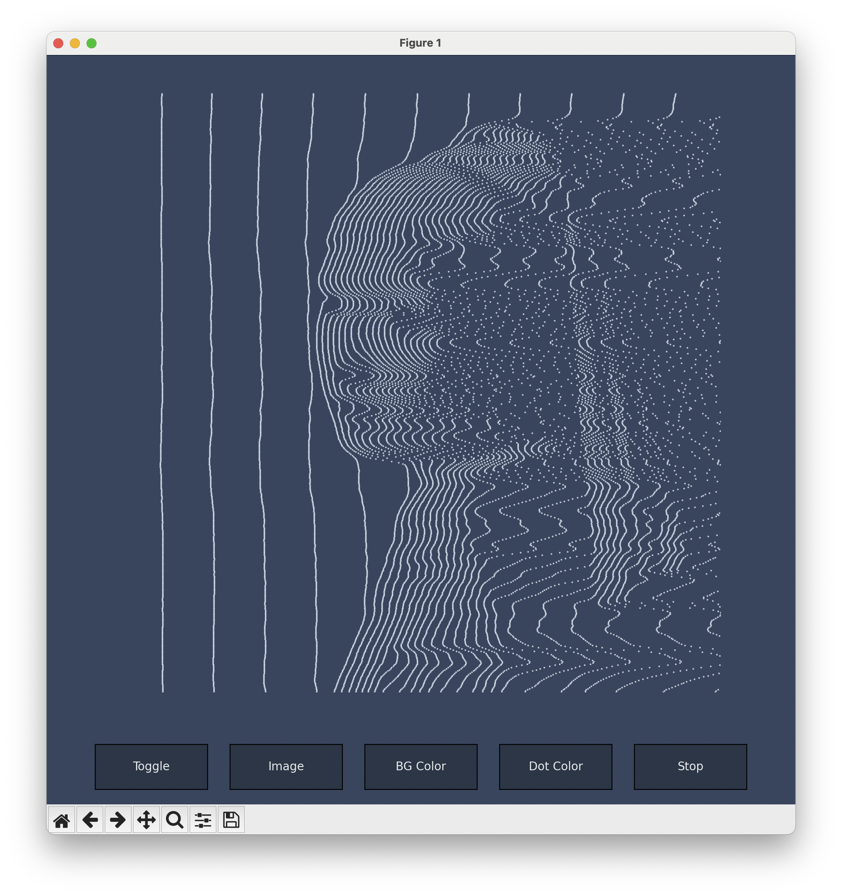

# Line Girl Effect



A Python implementation of the Line Girl effect (a variant of the Joy Division effect?). Inspired by this [Tweet](https://x.com/Moodsby_v/status/2000586572912042309) and this [Post](https://www.tumblr.com/low-sugar-eye-candy/169354251468/line-girl).

*Coded by Gemini 3 Pro and tweaked by me.*

# Run

Clone this repo:

```bash
git clone https://github.com/letmutex/line-girl-effect.git
cd line-girl-effect
```

Run:

```bash
uv run main.py
```

# License

```
Copyright 2025 letmutex

Licensed under the Apache License, Version 2.0 (the "License");
you may not use this file except in compliance with the License.
You may obtain a copy of the License at

    http://www.apache.org/licenses/LICENSE-2.0

Unless required by applicable law or agreed to in writing, software
distributed under the License is distributed on an "AS IS" BASIS,
WITHOUT WARRANTIES OR CONDITIONS OF ANY KIND, either express or implied.
See the License for the specific language governing permissions and
limitations under the License.
```
